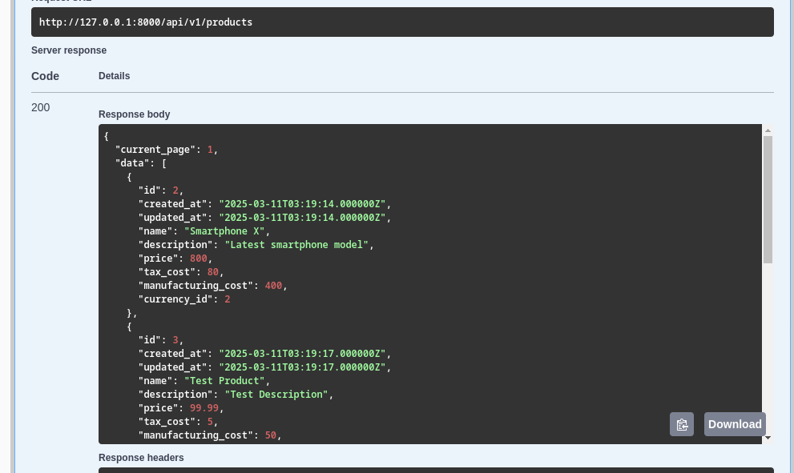

<!-- START doctoc generated TOC please keep comment here to allow auto update -->
<!-- DON'T EDIT THIS SECTION, INSTEAD RE-RUN doctoc TO UPDATE -->
**Table of Contents**  *generated with [DocToc](https://github.com/thlorenz/doctoc)*

- [api-productos](#api-productos)
  - [¡Optimiza tu API de productos con api-productos!](#%C2%A1optimiza-tu-api-de-productos-con-api-productos)
  - [Licencia](#licencia)
  - [Características ¿Qué te ofrece api-productos?](#caracter%C3%ADsticas-%C2%BFqu%C3%A9-te-ofrece-api-productos)
  - [Características a implementar](#caracter%C3%ADsticas-a-implementar)
  - [Planificación, Ingeniería de Requerimientos y Gestión de Riesgos](#planificaci%C3%B3n-ingenier%C3%ADa-de-requerimientos-y-gesti%C3%B3n-de-riesgos)
  - [Diseño de Software](#dise%C3%B1o-de-software)
    - [Perspectiva Estructural](#perspectiva-estructural)
      - [Vista Lógica de la Arquitectura del Software](#vista-l%C3%B3gica-de-la-arquitectura-del-software)
    - [Perspectiva de comportamiento](#perspectiva-de-comportamiento)
  - [Verification and Validation / Validacion y Verificacion](#verification-and-validation--validacion-y-verificacion)
    - [Diseño de Base de Datos](#dise%C3%B1o-de-base-de-datos)
    - [Uso](#uso)
      - [Requisitos](#requisitos)
        - [Instalacion](#instalacion)
          - [Como usuario](#como-usuario)
        - [Archivo .env](#archivo-env)
        - [Activar servidor](#activar-servidor)
      - [Accede a la documentacion de la api](#accede-a-la-documentacion-de-la-api)
      - [Acceso a la api](#acceso-a-la-api)
      - [Consume la api](#consume-la-api)

<!-- END doctoc generated TOC please keep comment here to allow auto update -->

**Table of Contents** *generated with [DocToc](https://github.com/thlorenz/doctoc)*

- [api-productos](#api-productos)
  - [¡Optimiza tu API de productos con api-productos!](#%C2%A1optimiza-tu-api-de-productos-con-api-productos)
  - [Licencia](#licencia)
  - [Características ¿Qué te ofrece api-productos?](#caracter%C3%ADsticas-%C2%BFqu%C3%A9-te-ofrece-api-productos)
  - [Desafíos Conquistados](#desaf%C3%ADos-conquistados)
  - [Características a implementar](#caracter%C3%ADsticas-a-implementar)
  - [Planificación, Ingeniería de Requerimientos y Gestión de Riesgos](#planificaci%C3%B3n-ingenier%C3%ADa-de-requerimientos-y-gesti%C3%B3n-de-riesgos)
  - [Diseño de Software](#dise%C3%B1o-de-software)
    - [Perspectiva Estructural](#perspectiva-estructural)
      - [Vista Lógica de la Arquitectura del Software](#vista-l%C3%B3gica-de-la-arquitectura-del-software)
    - [Perspectiva de Comportamiento](#perspectiva-de-comportamiento)
      - [Proceso de Creación de Productos](#proceso-de-creaci%C3%B3n-de-productos)
      - [Proceso de Actualización de Productos](#proceso-de-actualizaci%C3%B3n-de-productos)
  - [Verificación y Validación](#verificaci%C3%B3n-y-validaci%C3%B3n)
    - [Validación Formal](#validaci%C3%B3n-formal)
      - [Validación de la lógica de negocio](#validaci%C3%B3n-de-la-l%C3%B3gica-de-negocio)
  - [Documentación](#documentaci%C3%B3n)
    - [Convenciones usadas durante la documentación](#convenciones-usadas-durante-la-documentaci%C3%B3n)
    - [Generación de Endpoints](#generaci%C3%B3n-de-endpoints)
      - [ProductoController](#productocontroller)
      - [CurrencyController](#currencycontroller)
      - [ProductPriceController](#productpricecontroller)
  - [Uso](#uso)
    - [Requisitos](#requisitos)
      - [Instalación](#instalaci%C3%B3n)
        - [Como usuario](#como-usuario)
    - [Uso desde la interfaz de línea de comandos](#uso-desde-la-interfaz-de-l%C3%ADnea-de-comandos)
    - [Realiza una donación. Tu contribución hará la diferencia.](#realiza-una-donaci%C3%B3n-tu-contribuci%C3%B3n-har%C3%A1-la-diferencia)
    - [Encuéntrame en:](#encu%C3%A9ntrame-en)
  - [Tecnologías usadas](#tecnolog%C3%ADas-usadas)

# api-productos

## ¡Optimiza tu API de productos con api-productos!

¿Necesitas una API robusta y eficiente para gestionar tus productos? Con api-productos, obtén una solución completa para crear, leer, actualizar y eliminar productos, junto con la gestión de monedas y precios. ¡Prueba nuestra API y lleva tu gestión de productos al siguiente nivel!

## Licencia

Este código tiene licencia bajo la licencia pública general de GNU versión 3.0 o posterior (LGPLV3+). Puedes encontrar una copia completa de la licencia en https://www.gnu.org/licenses/lgpl-3.0-standalone.html

## Características ¿Qué te ofrece api-productos?

api-productos es una API integral diseñada para gestionar productos, monedas y precios de manera eficiente. Ofrece un conjunto de funcionalidades avanzadas que incluyen:

* **Gestión de Productos:**
    * Creación, lectura, actualización y eliminación de productos.
    * Soporte para descripción, precio, costo de impuestos y costo de fabricación.
    * Relación con monedas para gestionar precios en diferentes divisas.
* **Gestión de Monedas:**
    * Creación, lectura, actualización y eliminación de monedas.
    * Soporte para nombre, símbolo y tipo de cambio.
* **Gestión de Precios de Productos:**
    * Gestión de precios de productos en diferentes monedas.
    * Relación con productos y monedas.
* **API RESTful:**
    * Endpoints claros y bien definidos para todas las operaciones.
    * Respuestas en formato JSON.
* **Validación de datos:**
    * Validacion de todos los datos introducidos.

Con api-productos, podrás garantizar una gestión de productos sólida, eficiente y libre de errores comunes.

## Características a implementar

## Planificación, Ingeniería de Requerimientos y Gestión de Riesgos

Estas secciones del proyecto se llevarán a cabo mediante un sitio en Notion, de forma que puedan ser fácilmente accesibles por el personal no técnico.

Solicita el link de acceso al personal autorizado.

## Diseño de Software

### Perspectiva Estructural

#### Vista Lógica de la Arquitectura del Software

En el siguiente diagrama de clases se verán las abstracciones clave en el sistema, sus interacciones y responsabilidades.


### Perspectiva de comportamiento

## Verification and Validation / Validacion y Verificacion

### Diseño de Base de Datos


### Uso

#### Requisitos 

##### Instalacion 

###### Como usuario

composer install 

##### Archivo .env 

Establece una configuracion en el archivo .env. como la siguiente

```

DB_CONNECTION=pgsql
DB_HOST=127.0.0.1
DB_PORT=5432
DB_DATABASE=<DatabaseName>
DB_USERNAME=<UserName>
DB_PASSWORD=<password>

```

##### Activar servidor
Ejecuta el comando

php artisan serve


copia la url generada en este caso http://127.0.0.1:8000

#### Accede a la documentacion de la api

Utilizando la url generada en este caso http://127.0.0.1:8000 accede a la documentacion de la api

por medio de la url

http://127.0.0.1:8000/api/documentation

#### Acceso a la api 

Para tener acceso a la api debes de logearte con un usuario. 
Para pruebas con la api se creo un usuario con las siguientes credenciales
un email "correo@gmail.com" y password de"1234"


#### Consume la api

Puedes acceder a la api por medio de tu cliente http/https favorito postman, curl etc 




